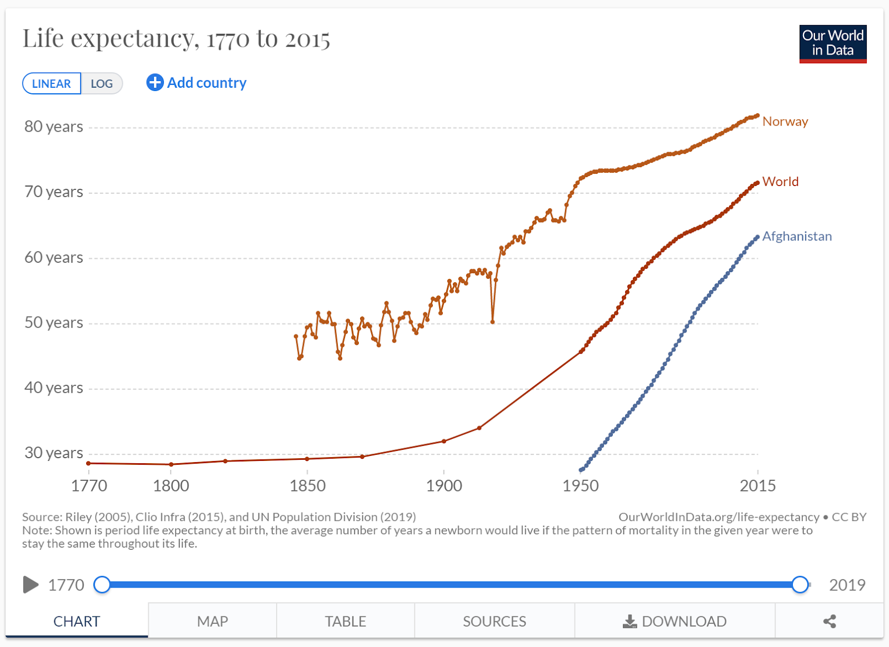
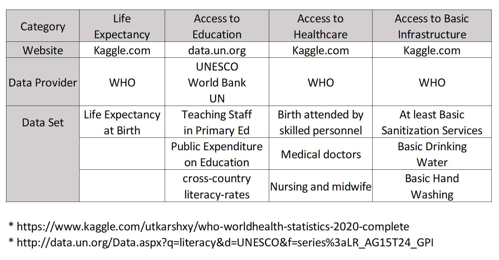

Project Title - Extract, Transform, Load - Life Expectancy 

Team Members - Parth Korat, Geoff Pawlowski, Ashutosh Sawant

Project Description/Outline:

Longer life; this is a universal goal that the world’s countries have been trying to achieve for its peoples’ since countries first came to be.  The good news is that the world has been wildly successful at extending life over the past two (2) centuries.  The more inconclusive news is that different countries have achieved varying results over time.  This is not unexpected as different countries develop at different rates.  Figure 1 is just one (1) example of how two countries can have very different life expectancy curves, relative to time.  However, with many datasets available to us at this time in history, we are hoping to take advantage of the stratification in life expectancy between countries and several other quantifiable variables.  We intend to extract this data, clean it and store it for potential analysis.  

Datasets To Be Used:  

Data Dictionary:

id: Primary Key, Serial \n
country: Country identifier, VARCHAR
year: Year of data collection, Calendar Year
expectancy: Years expected to live if survived birth, Int
birthattended: % of births attended by nurses or midwives, %
gdpspend: % of Gross Domestic Product spent on all levels of education, %
drinkingwater: % of households who have access to clean drinking water in their home, %
handwash: % of households who have access to basic santization for handwashing in the home, %
literacy: % of adults in country who are literate, %
meddoctor: number of doctors per 10,0000 persons per country, # personnel/10,000 people
nursemidwives: number of nurses and midwives per 10,000 persons per countyr, # personnel/10,000 people
stuteacherration: number of students per teacher in the primary education systems (similar to class room size), #students/teacher

