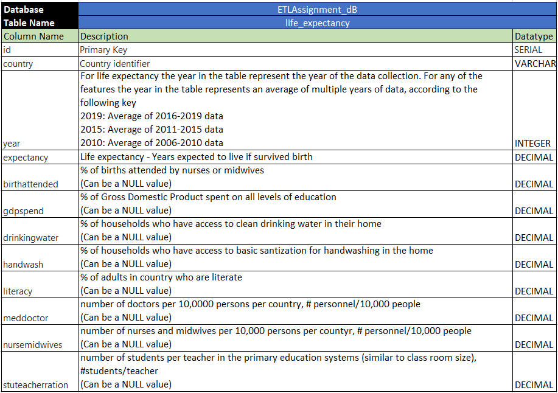

## Project Title - Extract, Transform, Load - Life Expectancy 

Team Members - Parth Korat, Geoff Pawlowski, Ashutosh Sawant

## Project Description/Outline

Longer life; this is a universal goal that the world’s countries have been trying to achieve for its peoples’ since countries first came to be.  The good news is that the world has been wildly successful at extending life over the past two (2) centuries.  The more inconclusive news is that different countries have achieved varying results over time.  This is not unexpected as different countries develop at different rates.  Figure 1 is just one (1) example of how two countries can have very different life expectancy curves, relative to time.  However, with many datasets available to us at this time in history, we are hoping to take advantage of the stratification in life expectancy between countries and several other quantifiable variables.  We intend to extract this data, clean it and store it for potential analysis.  

## Datasets To Be Used

## ETL

### Extract

All datasets were extracted from the links sourced in this readme file as .csv files.  

### Transform  

All .csv files were read into Jupyter Notebooks files and transformed into Pandas dataframes for cleaning.  The dataset from the UN needed additional cleaning within the .csv to convert text to columns. The years for the features had to be transformed via .replace(), so that the features and the outcome could be joined together. Later the extraneous countries had to be removed using a .notna() method so that the outcome feature had no null values. 

Data was graphed to visually inspected for outliers along with conducting anlytical box-plot outlier analysis.  There was a batch of data where decimal places were found to be moved 2 places in error after visual inspection and that was corrected.  

### Load

The final database with the following features were chosen to expediate the process for analysis of the life expectancy dataset.  PostgresSQL was the chosen database medium due to the relational nature of the inquiry and the stability of the Postgres platform.  One table containing all of the features could also allow for easier multivariate analysis, which was not possible before joining the data in this manner.    

## Data Dictionary

